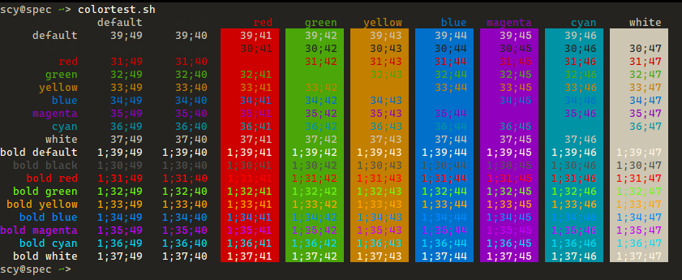

# _One Dark Pro_ Everywhere

This project will, based on the [Visual Studio Code](https://code.visualstudio.com/) color scheme [_One Dark Pro_](https://binaryify.github.io/OneDark-Pro/), create a full 16 color [ANSI palette](https://en.wikipedia.org/wiki/ANSI_escape_code#Colors) for use in terminal emulators, other editors etc.

## Screenshot

## Design Goals

1. Create any colors needed **programmatically**, based on the original _One Dark Pro_ colors.
2. Represent **the usual ANSI colors**. There are some people who get really creative with color schemes that basically contain only three colors in different variations. This can look beautiful, but once you have a diff where the added lines are yellow and the removed lines are a slightly lighter yellow, it gets annoying.
2. Allow **creating configuration files** for all the terminal emulators the author ([@scy](https://github.com/scy)) is using.
3. If there are things that suck (according to me) in the original theme, try to **fix them**.

## Status

I'm using it on several of my machines.
I'm not yet perfectly happy with it, expect some tuning.

Also, this is pretty much a personal project, I'm not sure whether I want to accept issues, pull requests etc.
Try it on your own risk. 😛
Maybe I'll even abandon this project again after a week.

## Supported Terminals/Editors

* [Termux](https://termux.com/)
* Visual Studio Code (via the original [_One Dark Pro_ extension](https://marketplace.visualstudio.com/items?itemName=zhuangtongfa.Material-theme))
* Windows Console (`cmd.exe`)
* xterm (via `.Xresources` file)

Planned:

* Linux text mode
* [Windows Terminal](https://github.com/Microsoft/Terminal)

## Building

Make sure to check out the `onedark-pro` submodule when cloning this repo.
Then, make sure the [colormath](https://python-colormath.readthedocs.io/) library is available.
I'm providing [Pipenv](https://docs.pipenv.org/) files to get it.

Fire up `convert.py`.
It will create several configuration files in the `out` directory and even create that if it doesn't exist because awesome UX.

You can also access the conversion logic from your own code by `import`ing `convert`.
Read the code for more information.

## Differences to Previous Projects

This project supersedes the [_Unexciting_](https://github.com/scy/unexciting) theme only two days after its initial creation.
This is because after creating _Unexciting_, I found out that creating a VS Code theme is more work that I want to invest.
Therefore, I had to choose an existing theme and create the terminal palettes based on it.

## License

MIT, see [LICENSE.txt](LICENSE.txt).
